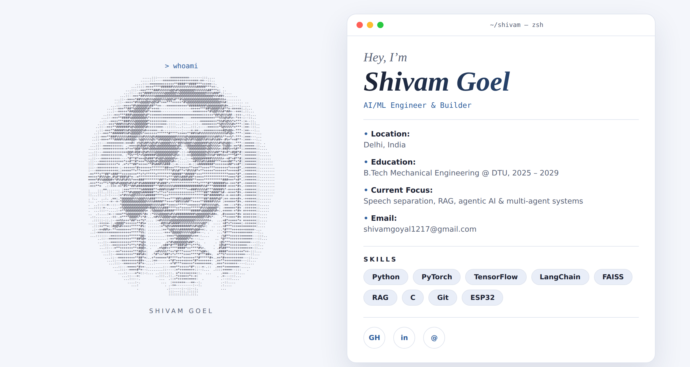
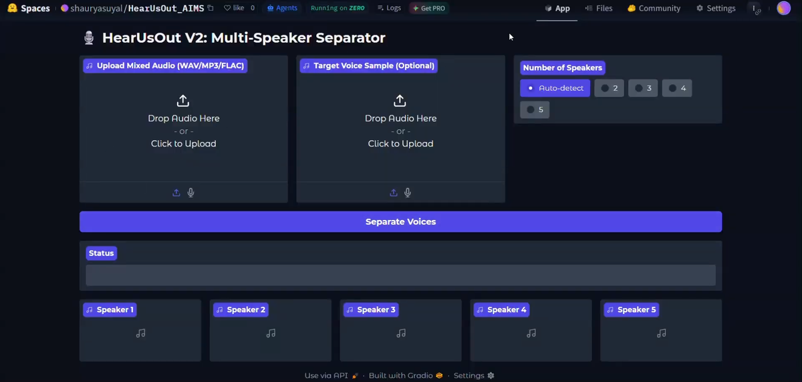
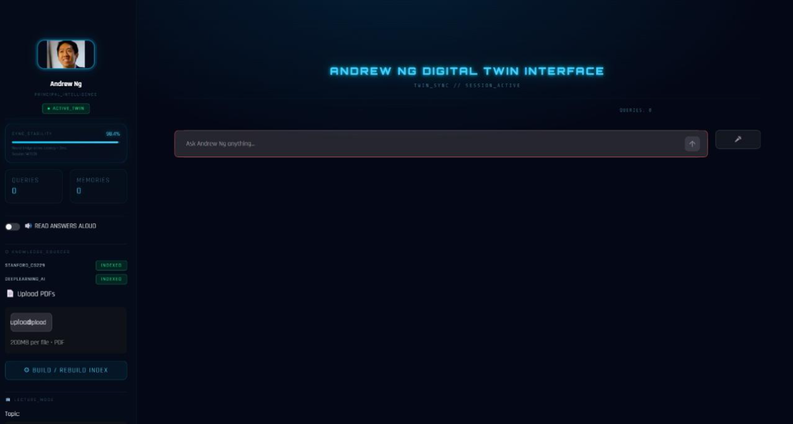
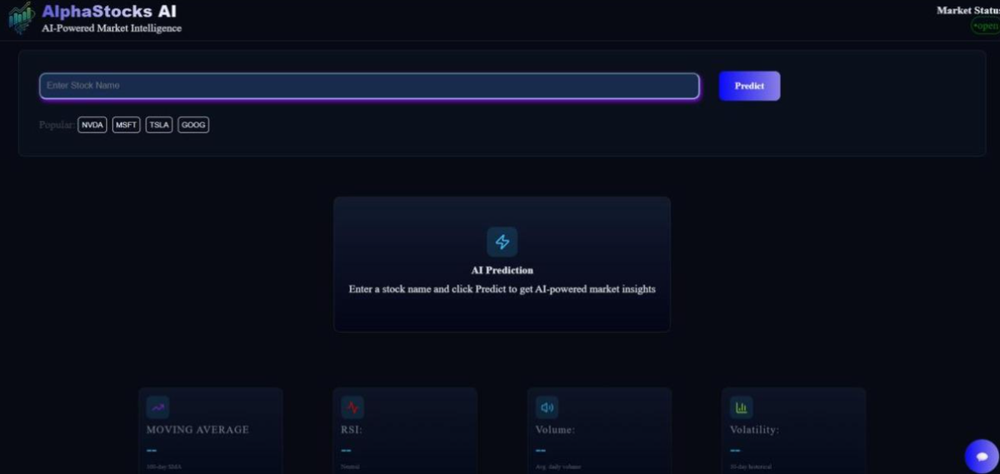

<div align="center">

<a href="https://techie-shivam.github.io/portfolio/">
  
</a>

</div>

<div align="center">

<a href="https://git.io/typing-svg">
  
</a>

<br/><br/>


[](https://linkedin.com/in/shivam-goel-73a188362)
[](mailto:shivamgoyal1217@gmail.com)


</div>

---

## 💻 `~/shivam — zsh`

```bash
$ whoami
shivam-goel

$ cat about.txt
Location      : Delhi, India 🇮🇳
Education     : B.Tech Mechanical Engineering @ DTU (2025 – 2029)
Role          : AI/ML Engineer & Builder
Current Focus : Speech Separation · RAG · Agentic AI · Multi-Agent Systems
Superpower    : Turning research papers into working systems
Fun fact      : Mechanical student who ended up training neural networks 😄
Email         : shivamgoyal1217@gmail.com

$ echo "Let's build something intelligent together 🚀"
```

---

## 🚀 Featured Projects

<table>
  <tr>
    <td width="50%" valign="top">

### 🎧 HearUsOut
**Real-World Speech Separation**



Robust speech separation pipeline built on a fine-tuned **SR-CorrNet**, reaching **19+ dB SI-SDRi** on noisy real-world audio. Adaptive preprocessing with VAD-based routing handles clipping, silence, loudness shifts and overlapping speakers. Zero-shot target speaker extraction via **ECAPA-TDNN**, with **DeepFilterNet** artifact refinement.


[🔗 View Repo](https://github.com/Techie-shivam/HearUsOut)

  </td>
    <td width="50%" valign="top">

### 🧑‍🏫 Andrew Ng Digital Twin
**RAG-powered conversational AI**



Chat with a digital twin grounded in Andrew Ng's lecture notes using **LangChain + FAISS**. Includes **Gemini/Groq LLM fallback**, short-term and persistent memory, automated source citations, offline voice I/O and a **Streamlit** interface.


[🔗 View Repo](https://github.com/Techie-shivam/Andrew-Ng-Digital-Twin)

  </td>
  </tr>
  <tr>
    <td width="50%" valign="top">

### 🤖 Agentic AI Research System
**Autonomous multi-agent research**

Multi-agent system that autonomously **plans, retrieves, generates and verifies** arXiv research. **FAISS** retrieval with `bge-small-en-v1.5` embeddings, **Groq/Ollama** agents, iterative self-reflection and tool-calling for research synthesis.


[🔗 View Repo](https://github.com/Techie-shivam/Agentic-AI-Research-System)

  </td>
    <td width="50%" valign="top">

### 📈 Stock Market Web App (AlphaStocks AI)
**Full-stack prediction platform (team of 4)**



**LSTM-based** price prediction, real-time news integration and an **AI-powered chatbot**, delivered as a full-stack web application.


[🔗 View Repo](https://github.com/Techie-shivam/Stock-Market-Web-App)

  </td>
  </tr>
</table>

---

## 🛠️ Tech Arsenal

<div align="center">

**Languages**


**ML / Deep Learning**


**GenAI & Agents**


**Hardware & Tools**


</div>

---

## 💼 Experience

| Role | Company | Focus |
|------|---------|-------|
| 🧪 **SDET Intern** | Autoload AI Systems Pvt. Ltd. · 2026 | Software testing, automation, performance scripting for reliable, scalable software |
| 🧠 **AI/ML Intern** | Veracy Consulting · 2026 | Data preprocessing, EDA, supervised & unsupervised learning, building and evaluating ML models |

---

## 🏆 Achievements

<div align="center">


</div>

---

## 🎓 Certifications

<div align="center">


</div>

---

## 📊 GitHub Stats

<div align="center">


<br/>


<br/><br/>


</div>

---

## 🐍 Contribution Snake

<div align="center">

<picture>
  <source media="(prefers-color-scheme: dark)" srcset="https://raw.githubusercontent.com/Techie-shivam/Techie-shivam/output/github-snake-dark.svg" />
  <source media="(prefers-color-scheme: light)" srcset="https://raw.githubusercontent.com/Techie-shivam/Techie-shivam/output/github-snake.svg" />
  
</picture>

</div>

---

## 🧭 Currently

- 🔭 Pushing speech separation quality on real-world, noisy audio
- 🌱 Going deeper into agentic AI, RAG and multi-agent systems
- ⚙️ Bridging mechanical engineering with ESP32 / Arduino and AI
- 🤝 Open to collaborating on AI/ML, GenAI and speech projects
- 💬 Ask me about: PyTorch, RAG pipelines, LLM agents, audio ML

---

<div align="center">

### 📬 Let's Connect

[](https://linkedin.com/in/shivam-goel-73a188362)
[](mailto:shivamgoyal1217@gmail.com)


*⭐ If you like my work, drop a star on a repo!*

</div>
